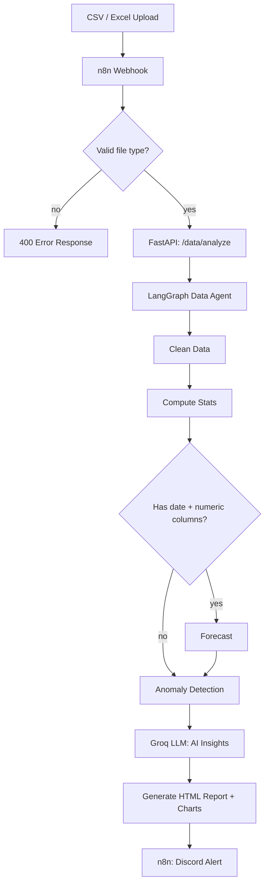

# 📊 AI Data Analyst Agent

**CSV/Excel in → cleaning, anomaly detection, forecasting, AI insights out → Discord report.**

A standalone AI agent that takes any CSV or Excel file, cleans it, computes statistics, detects anomalies, forecasts trends, generates an AI-written executive summary, and delivers a full HTML report — triggered through n8n and alerted via Discord.

## Architecture



## How it works

1. A file is POSTed to the n8n webhook (`/webhook/analyze`)
2. n8n validates the file extension before forwarding it
3. The file goes to a FastAPI backend running a LangGraph agent with conditional branching:
   - Cleans the data (removes duplicates, fills missing values)
   - Computes summary statistics for every numeric column
   - **Branches**: if the dataset has a date column and a numeric column, it forecasts the next 3 periods using linear trend fitting; otherwise it skips straight to anomaly detection
   - Detects anomalies using z-score analysis (|z| > 3)
   - Asks Groq's LLM to write a concise executive summary grounded in the actual computed numbers
   - Renders a full HTML report with embedded charts (matplotlib, base64-inlined)
4. n8n posts a summary + report link to Discord

## Screenshots

**n8n workflow — file validation, agent call, and Discord alerting**


**Discord alert with AI-generated summary and report link**


**Generated HTML report — charts, forecast, and anomalies**


## Tech stack

| Layer | Technology |
|---|---|
| Orchestration | n8n |
| Backend / Agent | Python, FastAPI, LangGraph |
| Data processing | Pandas, NumPy |
| Visualization | Matplotlib (server-rendered, embedded as base64 PNG) |
| LLM | Groq (`openai/gpt-oss-20b`) |
| Alerts | Discord webhook |
| Infrastructure | Docker Compose |

## Running it locally

```bash
cp .env.example .env      # fill in your Groq API key
docker compose up -d --build backend
# import n8n-workflows/data-analyst-intake.json into your n8n instance
```

| Service | URL |
|---|---|
| Backend API | http://localhost:8002 |
| Health check | http://localhost:8002/health |

## API

- `POST /data/analyze` — multipart file upload, returns cleaning summary, stats, anomalies, forecast, AI insights, and a report URL
- `GET /data/report/{report_id}` — renders the full HTML report with charts

## Status

- [x] Data cleaning pipeline
- [x] Statistical summary
- [x] Conditional forecasting (LangGraph branch)
- [x] Anomaly detection (z-score)
- [x] AI-generated executive summary
- [x] HTML report with embedded charts
- [x] n8n webhook with file-type validation
- [x] Discord alerting
- [ ] Support for SQL database sources

---

Built by **Keyur Solanki** — n8n · Python · FastAPI · LangGraph · Pandas · Groq
